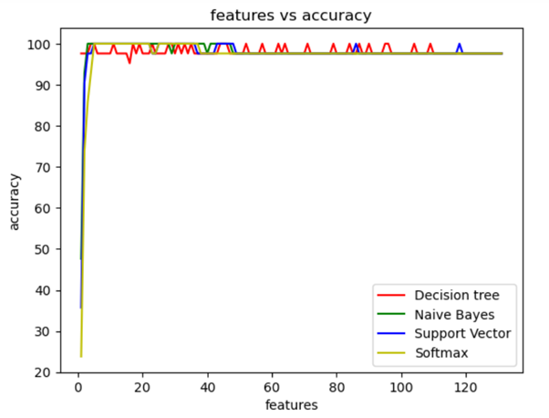
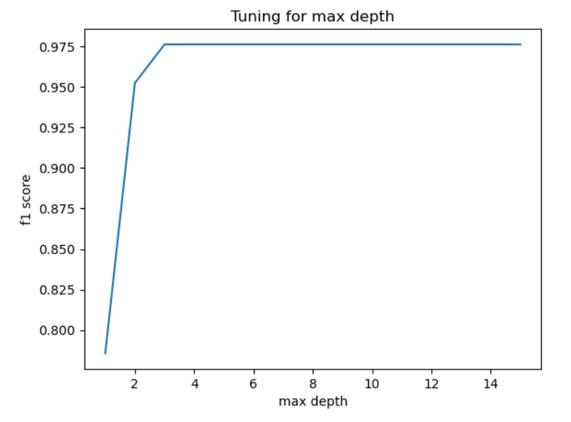
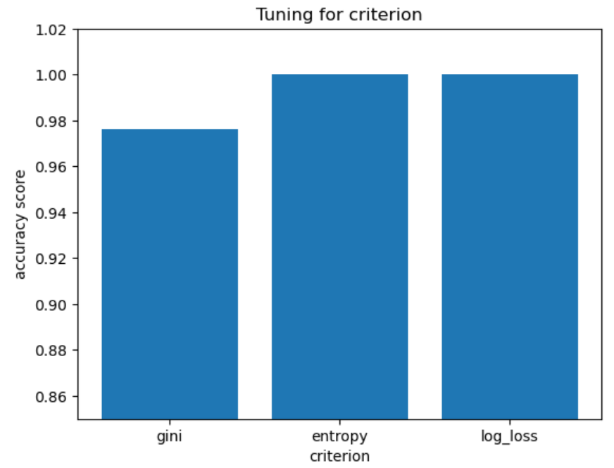
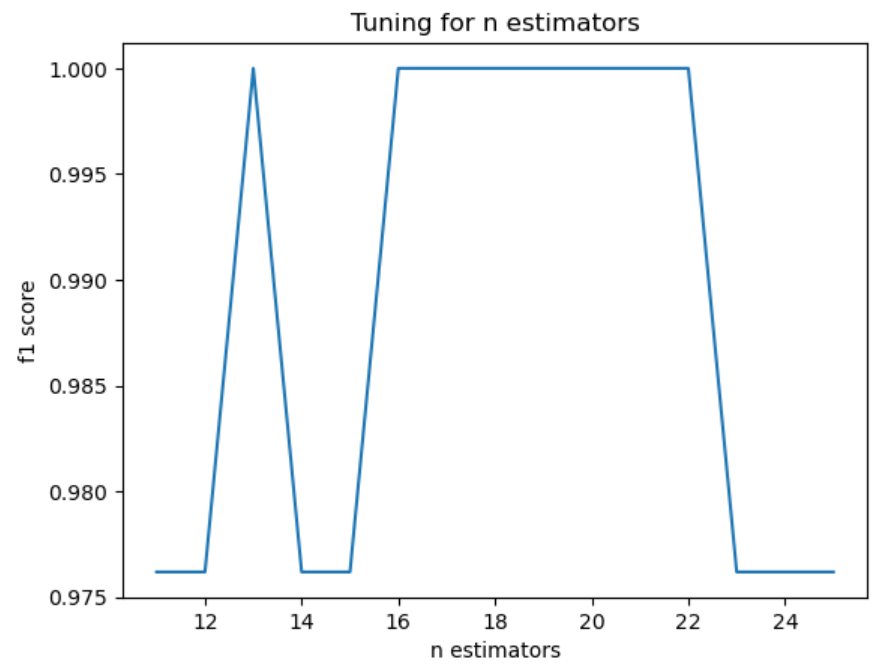
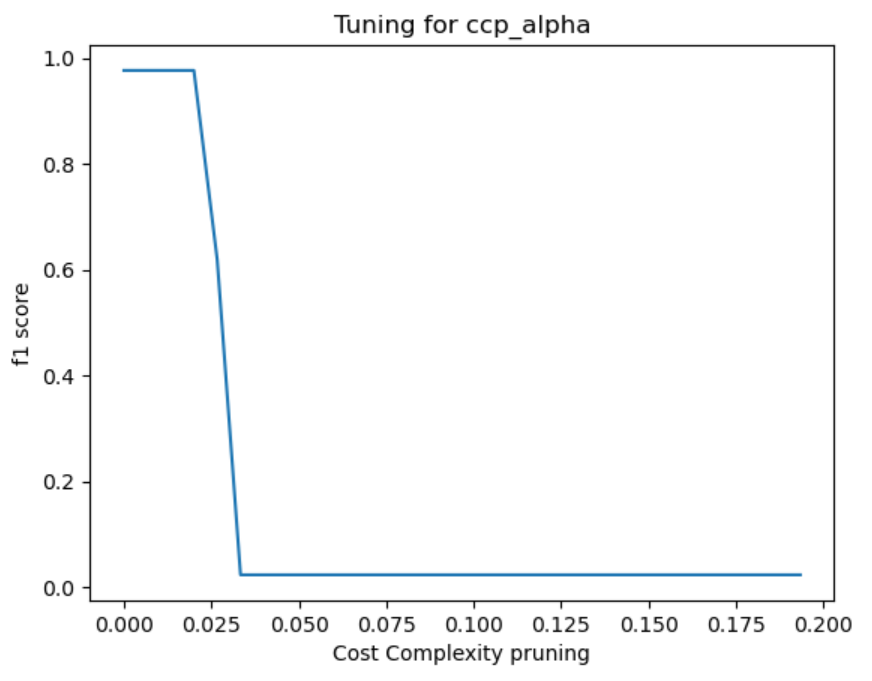

# Machine Learning Algorithm for Disease Classification

## Overview

This project explores the application of machine learning algorithms to classify diseases based on symptom data. The dataset includes two CSV files: one for training and one for testing. Each file contains 133 columns—132 of which represent various symptoms, and the last column denotes the disease prognosis. The goal is to develop and evaluate models that can accurately classify symptoms into one of 42 diseases.

### Objectives

- **Evaluate Four Supervised ML Models:** Compare the performance of Decision Tree Classifier, Support Vector Classifier (linear), Naive Bayes Classifier, and Softmax Regression (multiclass logistic regression).
- **Dimensionality Reduction:** Apply Principal Component Analysis (PCA) to reduce dimensionality and assess the impact on classification accuracy. Plot the relationship between classification accuracy and the number of PCA features.
- **Random Forest Optimization:** Implement the Random Forest algorithm and optimize hyperparameters to achieve the best classification accuracy.

## Approach

### a. Supervised Machine Learning Models

The following models were utilized:
- **Decision Tree Classifier**
- **Support Vector Classifier (linear)**
- **Naive Bayes Classifier**
- **Softmax Regression (multiclass logistic)**

#### Results

| Classification Algorithm Used | Accuracy       |
|:-----------------------------:|:--------------:|
| Decision Tree Classifier      | 97.62%         |
| Naive Bayes Classifier       | 100.0%         |
| Support Vector Classifier     | 100.0%         |
| Softmax Regression           | 97.62%         |

### b. Dimensionality Reduction with PCA

PCA was applied to reduce the number of features from 132, and the classification accuracy was plotted against the number of principal components.

#### Results

### c. Random Forest Algorithm and Hyperparameter Tuning

Initial accuracy with Random Forest Classifier was 97.62%. Hyperparameters were tuned to enhance performance:
- **max_depth**
- **criterion**
- **n_estimators**
- **ccp_alpha**

#### Results

| Parameter Tuned  | Performance vs Value        | Observation                                                         | Conclusion                               |
|:----------------:|:----------------------------:|---------------------------------------------------------------------|------------------------------------------|
| max_depth        |     | Accuracy plateaued after a depth of 3                               | **Optimal value: 3**                     |
| criterion        |     | 'gini' performed poorly compared to 'entropy' and 'log_loss'         | **Optimal value: entropy/log_loss**      |
| n_estimators     |  | Accuracy peaked at 13, and remained high between 15 and 23          | **Optimal value: 19 (average of 15, 23)** |
| ccp_alpha        |     | Accuracy consistently decreased with higher values                  | **Optimal value: 0.0**                   |

To ensure consistent results, the random state was set based on peak accuracy values, with 14 identified as optimal.

**After tuning, the Random Forest Classifier achieved a classification accuracy of 100%.**

